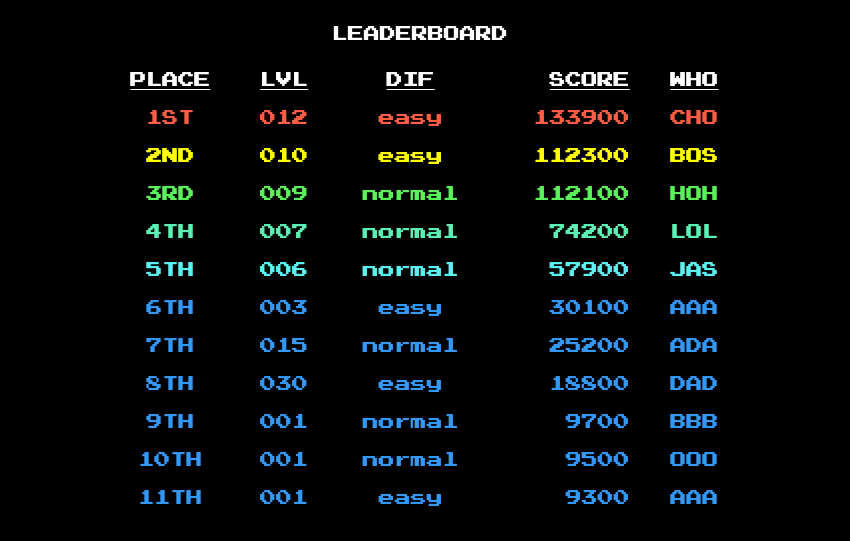

**Type Defender** is a retro-style typing game where you stop digital threats by typing real programming keywords. Improve your coding fluency, boost your typing speed, and save the world—one keystroke at a time.

## Play Now !

[Demo] https://bossclaw.github.io/cpan-113-group-proj/
[Issue Board] https://github.com/BossClaw/cpan-113-group-proj/issues
[Feature Branches] https://github.com/BossClaw/cpan-113-group-proj/branches

## Project Review Video

[Watch the Project Review Video Here](https://www.youtube.com/watch?v=1b4TxSrrb9I)

## Sections

- [How to Play](#how-to-play)
- [Features](#features)
- [Tech Stack](#tech-stack)
- [Credits](#credits)
- [Special Thanks](#special-thanks)
- [Feature Demo Gifs](#feature-demos)

  ## Installation
  -Clone the Repo
  -Open index.html in the browser

## How to Play

1. **Choose your programming languages**  
   Select one or more languages. The game will use real keywords from these selections.

2. **Watch for enemies**  
   Evil bugs will appear on the right side of the screen and begin moving toward your mainframe.

3. **Type the word correctly**  
   Each bug displays a keyword. Type it exactly and press **Enter** to attack.

   - Correct entries reduce the enemy's HP.
   - Incorrect entries or failed inputs result in a missed attack and spawn more enemy.

4. **Protect your mainframe**  
   If an enemy reaches the firewall or mainframe, you take damage. When your HP drops to zero, the game ends.

5. **Progress through increasing difficulty**  
   As you survive longer, enemies use longer and more complex keywords. Some bugs may become stronger or faster.

6. **Use the virtual keyboard**  
   A virtual keyboard highlights your key presses as visual feedback. Alternate layout support may be added in future versions.

7. **End of game: Continue or quit**  
   Once the game ends (win or lose), you’ll have the option to enter your initials if your score qualifies for the leaderboard.

## Features

1. **Typing-Based Combat**  
   Players eliminate monsters by typing programming keywords correctly and quickly.
   

     
   

2. **Game Settings Customization**  
   Users choose languages, difficulty, and level. Settings are saved in local storage and auto-loaded next time.
   

     
   

3. **Interactive Keyboard**  
   A retro-style virtual keyboard shows key presses and triggers actions like shooting or spawning monsters.
   

     
   

4. **Leaderboard System**  
   At game end, players can enter initials to save their high scores if they qualify.
   

     
   

5. **Audio Integration**  
   Audio enhances gameplay. A prompt appears at launch to enable/disable sound, and the choice is remembered.
   

     
   

6. **Retro Visual Design**  
   Custom background art, CSS effects, and sprites create an old-school coding interface vibe.
   

     
   

7. **Difficulty Scaling**  
   Monster speed and strength scale with the chosen difficulty and level.

## CREDITS

### Everyone

- Design, Planning, Testing

- Coding

- CSS

- HTML

- GitHub Management

- Communications

### [Kuo Yu Lu](https://github.com/klu0926)

- Lead Gameplay Dev

- Lead "Sneaky Creepy Things in" Dev

### [Jasmine](https://github.com/Jaysandjay)

- Lead Keyboard Dev
- Lead Languages Data Dev
- Lead Local Storage Dev
- Lead "Get it done before it's even known" Dev

### [Darryl](https://github.com/BossClaw)

- Project Manager
- Pixel Art
- 8 bit sound effects
- Discord channel spawner

## Tech Stack

- HTML5 + CSS3
- JavaScript (ES6 Modules)

## Libraries

- [Animate.CSS](https://animate.style)
- [CRT.CSS (CC0 License)](https://github.com/protesilaos/crt.css)

## Assets

- [Phat Phrog Music](https://phatphrog.com)
- [KENOPSIA Imperfect Sounds – CC BY-NC 4.0](https://freemusicarchive.org/music/Kenopsia/)
- [PressStart2P – SIL Open Font License](https://fonts.google.com/specimen/Press+Start+2P)

## SPECIAL THANKS

- **Little One, Moo Moo & Christopher Kitten**
- **Lu Crew**
- **Jaz Pizazz**

## FEATURE DEMOS

Audio user consent.

Configure Mission

Intense GamePlay

---
